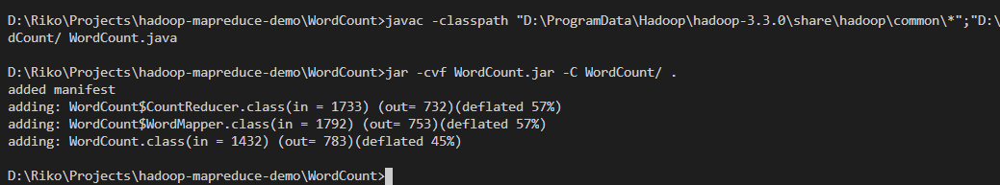
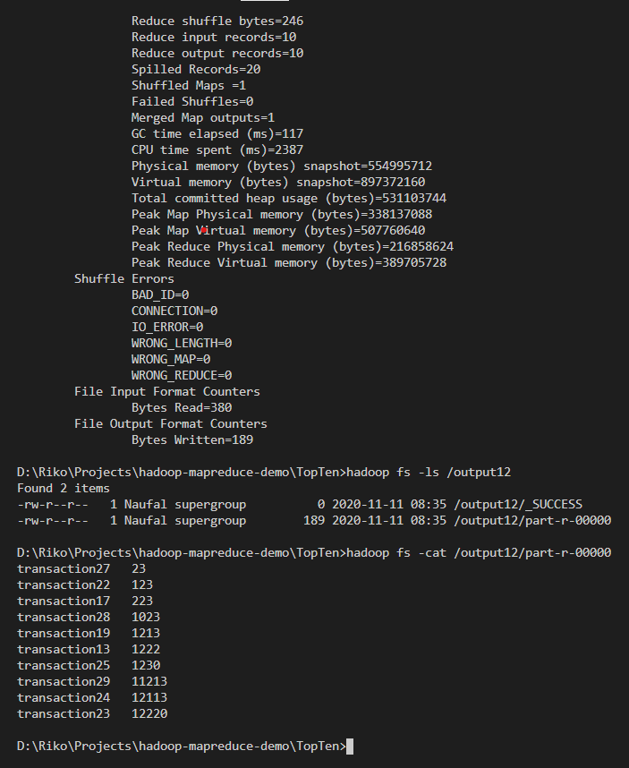

# Hadoop Example Program Demo

-------

## Program Dependencies

-------
When compile & run this program, this is dependenciees I've used:

1. [Hadoop 3.3.0](https://hadoop.apache.org/releases.html)
2. Hadoop 3.3.0 Fixes, I've included this in `hadoop-3.3.0-configs.zip` in this project
3. [JDK 8](https://www.oracle.com/java/technologies/javase/javase-jdk8-downloads.html) (Java Development Kit 8)
4. [Windows 10](https://www.microsoft.com/en-us/software-download/windows10) as operating system

## Practice recommended

-------
I should say that this is my first hadoop try, and I found that this program a bit buggy for me, and need a loot of manual configuration, so this is my advices for you,

1. Run `start-dfs` and `start-yarn` as ADMIN, when not as ADMIN I found the `HDFS` an d`yarn` service couldn't run properly.

## Algortihm Included

-------

1. Word Count
2. Average
3. Top Ten


## Word Count

### Compile

-------

1. Navigate to `WordCount` folder for make it easier
2. Compile the java file or `WordCount.java` file and link it with needed hadoop library in `%HADOOP_HOME%\share\hadoop`, for example with this code
    ```
    javac -classpath "D:\ProgramData\Hadoop\hadoop-3.3.0\share\hadoop\common\*";"D:\ProgramData\Hadoop\hadoop-3.3.0\share\hadoop\mapreduce\*" -d WordCount/ WordCount.java
    ```

3. Create jar file from the classes, for example with this code
    ```
    jar -cvf WordCount.jar -C WordCount/ .
    ```

As an example, this is compilation step in my test




### Run

-------

1. Make sure that `HDFS` and `yarn` service already started, by running these command (my advice run in the terminal as ADMINISTRATOR)
    ```
    start-dfs
    start-yarn
    ```

    I've already included `%HADOOP%_HOME\sbin` in the PATH, so that should be work.

2. Write the text file that want to be counted, for example `wordcount.txt` that I want to create here
3. Create a directory in hadoop as the input directory, for example here `/input9` by running this command
    ```
    hadoop fs -mkdir /input9
    ```

4. Place your text file into hadoop directory that already created (should be empty), for example by this code
    ```
    hadoop fs -put wordcount.txt /input9
    ```

    make sure it already created by `ls` command in hadoop, for example by this code
    ```
    hadoop fs -ls /input9
    ```

    it would show something like this,

    

5. Run hadoop `.jar` program by input directory is the directory that has just been created, and output directory is a new or non-existent directory, for example by this code
    ```
    hadoop jar WordCount.jar WordCount /input9 /output9
    ```

    just wait first and would show something like this,

    

6. After finish, explore the output directory and try to `cat` file there, and you should find the result there, as in this example
   
     


## Average

### Compile

-------

1. Navigate to `Average` folder for make it easier
2. Compile the java file or `Average.java` file and link it with needed hadoop library in `%HADOOP_HOME%\share\hadoop`, for example with this code
    ```
    javac -classpath "D:\ProgramData\Hadoop\hadoop-3.3.0\share\hadoop\common\*";"D:\ProgramData\Hadoop\hadoop-3.3.0\share\hadoop\mapreduce\*" -d Average/ Average.java
    ```

3. Create jar file from the classes, for example with this code
    ```
    jar -cvf Average.jar -C Average/ .
    ```

As an example, this is compilation step in my test


### Run

-------

1. Make sure that `HDFS` and `yarn` service already started, by running these command (my advice run in the terminal as ADMINISTRATOR)
    ```
    start-dfs
    start-yarn
    ```

    I've already included `%HADOOP%_HOME\sbin` in the PATH, so that should be work.

2. Write the text file that want to be counted, for example `average.txt` that I want to create here
3. Create a directory in hadoop as the input directory, for example here `/input11` by running this command
    ```
    hadoop fs -mkdir /input11
    ```

4. Place your text file into hadoop directory that already created (should be empty), for example by this code
    ```
    hadoop fs -put average.txt /input11
    ```

    make sure it already created by `ls` command in hadoop, for example by this code
    ```
    hadoop fs -ls /input11
    ```

    it would show something like this,

    

5. Run hadoop `.jar` program by input directory is the directory that has just been created, and output directory is a new or non-existent directory, for example by this code
    ```
    hadoop jar Average.jar Average /input11 /output11
    ```

    just wait first and would show something like this,

    

6. After finish, explore the output directory and try to `cat` file there, and you should find the result there, as in this example
   
    

## Top Ten

### Compile

-------

1. Navigate to `TopTen` folder for make it easier
2. Compile the java file or `TopTen.java` file and link it with needed hadoop library in `%HADOOP_HOME%\share\hadoop`, for example with this code
    ```
    javac -classpath "D:\ProgramData\Hadoop\hadoop-3.3.0\share\hadoop\common\*";"D:\ProgramData\Hadoop\hadoop-3.3.0\share\hadoop\mapreduce\*" -d TopTen/ TopTen.java
    ```

3. Create jar file from the classes, for example with this code
    ```
    jar -cvf TopTen.jar -C TopTen/ .
    ```

As an example, this is compilation step in my test


### Run

-------

1. Make sure that `HDFS` and `yarn` service already started, by running these command (my advice run in the terminal as ADMINISTRATOR)
    ```
    start-dfs
    start-yarn
    ```

    I've already included `%HADOOP%_HOME\sbin` in the PATH, so that should be work.

2. Write the text file that want to be counted, for example `topten.txt` that I want to create here
3. Create a directory in hadoop as the input directory, for example here `/input10` by running this command
    ```
    hadoop fs -mkdir /input10
    ```

4. Place your text file into hadoop directory that already created (should be empty), for example by this code
    ```
    hadoop fs -put topten.txt /input10
    ```

    make sure it already created by `ls` command in hadoop, for example by this code
    ```
    hadoop fs -ls /input10
    ```

    it would show something like this,

    

5. Run hadoop `.jar` program by input directory is the directory that has just been created, and output directory is a new or non-existent directory, for example by this code
    ```
    hadoop jar TopTen.jar TopTen /input10 /output10
    ```

    just wait first and would show something like this,

    

6. After finish, explore the output directory and try to `cat` file there, and you should find the result there, as in this example
   
    